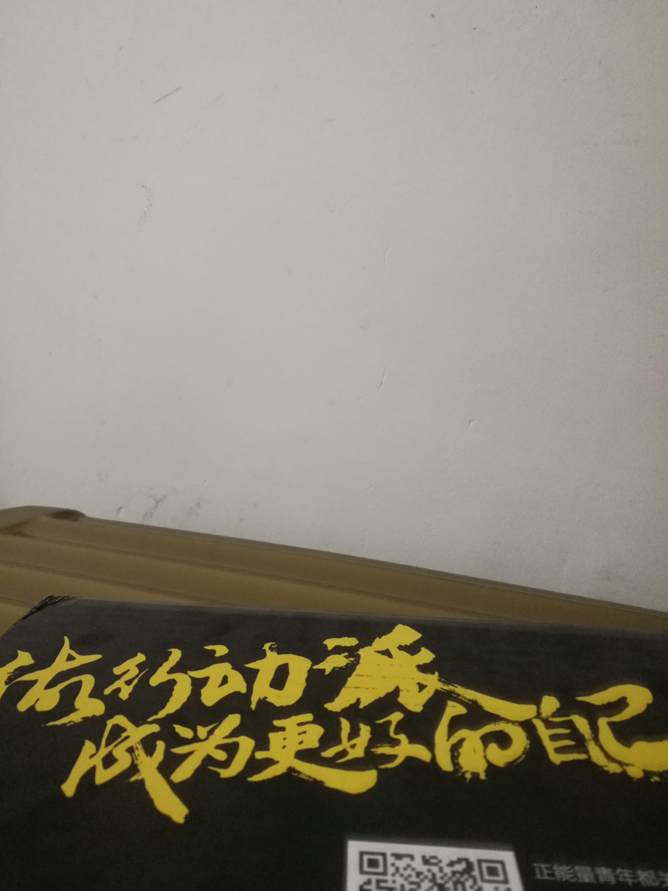
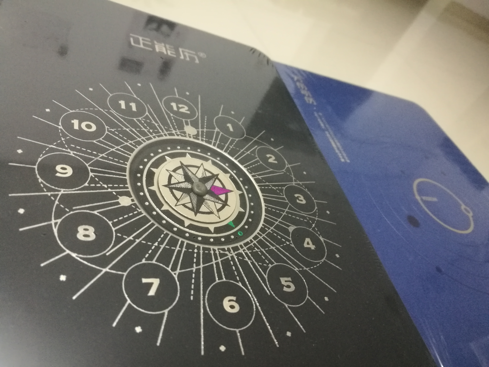

#《一个人的金融之战》
##连载七
>一路上，会遇到很多同道中人，见过的、没见过的，交往的、没交往的，网上的、网下的，总之，因为某种原因恰好遇上了。他们在各自的江湖中修行，从容地生长着。他们，都是一群有故事的人，都是值得被尊重的人。

>他们，目标一样，只是，因各自条件、背景不一，导致所走之路迥然。他们或者同时干着几份不同的工作，走走停停；或者从底层做起，一步一个脚印；或者从一座城换到另一座城，只为一个类似的工作机会，坚定不移；他们把现实藏在梦想里，把梦想藏在心里，游走在现实与理想的边缘，小心地呵护着心中的梦。有人说他们傻B，有人说他们牛B，他们默默不语，直到后来，有人发现当初傻B一样的人，后来有了牛B一样的收获……

>有理想，就会有故事，世界很大，有故事的人很多。他们因某种因缘相遇，然后成了彼此的精神支柱。迷茫时，他们是一盏明灯，用一点光，照亮你的前程；失落时，他们是一面镜子，为你找到来时的路，给你再去相信的勇气。这些人，相互鼓励、相互取暖，在他们心里未来就是做梦的勇气，他们相信有梦就会有黎明！

>他们有各自的经历或阅历，他们是现实的配角，却是理想的主角。尽管，实现理想，他们有人用了整个青春，有人闯了大半生。但是，他们愿意为此而战，永不后悔！他们重头再来了好多次，在不同的城市、不同的地方，不停地重头再来，不停地接受命运的考验。他们，信天信地信自己！
>>在路上，不要跟错了人，不然会是莫大的悲哀！有缘遇上他们，是我的福气，也是我一生的荣幸！

>又想起了之前在公司培训了一年多的哪位学员在临走时跟我们讲的那句话：我想再去建筑工地做搬运工一段时间，等赚点生活费后再回来……
> 
光阴如潮，大浪淘沙，谁又知道在未来未知的年月里，回首往事，会有几多欢笑几多愁？！

