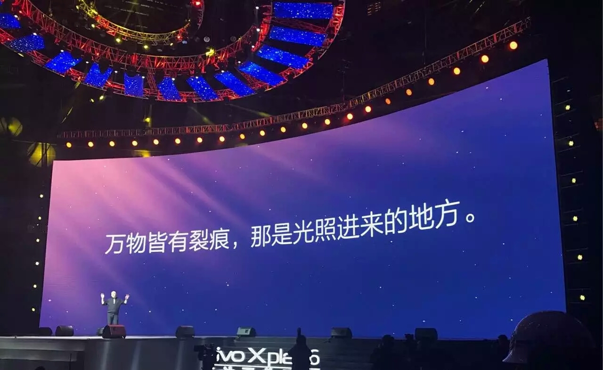

#《一个人的金融之战》
##连载三
***
>抗战八年，还学到了什么，独立？坚强？自我调节能力？学习能力？……哈哈，打住，佛有言：
>>是也，非也！

>>不需要矫情，远离消极、悲观，来点正能量或许会更给力些，在这个风花雪月的和平年代。
> 这八年，谈不上有什么旷世传奇的人生经历，不过也体会了不少冷暖人生、不古人心。但是无论怎样，不管多艰难，没有谁能够阻挡我对自由的向往！

>朋友问：
>>是谁引领你走上了这条路？

>我说：
>>没有谁，相反，当初几乎所有人都劝我不要走这条路。

> 所以，是我自己，怀着所谓的金融梦，所谓的理想，然后摸着石头过河、“铤而走险”，自己领着自己走上了这条路，一条孤独而漫长的路。当然，我知道，劝我的那些人，都是好人，都怕我走错路，因为在他们心里都觉得这条路很难走，甚至不能走，尤其像我们这类的普通人，因为他们听过不少关于这条路的“传说”。可是，我不是一个喜欢走寻常路的人，不喜欢按部就班、千篇一律的生活，而且，每个人都有自己的梦，所以只要认准了方向是对的，我愿意一条道走到黑，哪怕倾我所有。
可喜的是，这条道，八年之后，我看到的:
>>不是“黑”，而是光明…..

> 人活一世，一个人来到这个世界，最终也是一个人离开。所以，紧握拳头，命运必须由自己来掌控，人生必须由自己去设定，绝不做任何人的人生续集。我要的是将来，不是将就，没有官二代，不是富二代，只想做好属于自己的一代……

