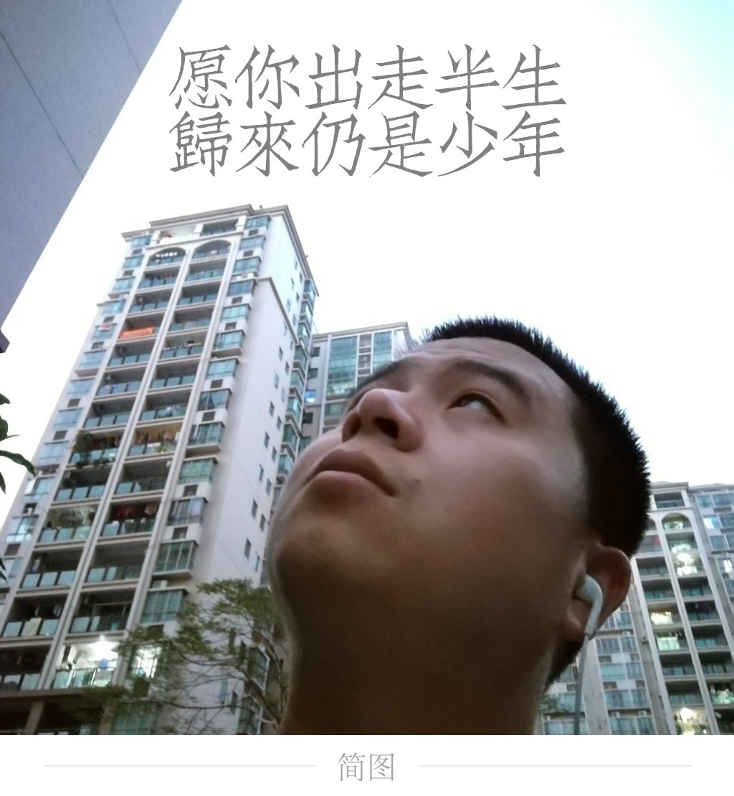

#《一个人的金融之战》
##连载八
***
>曾经，不知道股票是什么，股市为何物。直到大学时老师上的那门《证券投资学》，才渐渐有所了解，也正是这位老师每次上课时激情彭拜地说着有关股市的“神奇”，才激起了自己对它的兴趣。然后结合自身的特点以及对未来的向往，慢慢做起了“金融梦”。
> 后来，接触这方面的东西越多，听的流言越多，越觉得不是那么回事，加上社会上各种其他的复杂因素，越感到困难重重，但心中的那个梦还是未改！

>期间也求职过不少这方面的工作，但都不是自己真正想要的那份职业，翻来覆去，折腾了不少时间。
> 

>现在回过头再看，股市就是“故事”，都是国家、庄家、机构在做文章，在讲故事。
> 
>低位时各种利空、各种不好的消息席卷而来让你乖乖地交出手中的筹码，到了高位则是各种利多、各种利好的消息满天飞诱惑你接下他们手中所有的筹码，然后你站在高高的山岗上，不久之后却发现真是“一览众山小”，但已是“高处不胜寒”！

>不少人谈股色变，但，存在即合理，任何事物的发展都有其规律，股市也一样。害怕、觉得股市是赌博，看不清、摸不着，是因为对它没有足够的了解，还没有发现其规律，更不能掌握与运用这个规律，对于这类人，确实很难做好，就像别人也可能做不好他们的工作是一样的道理，不在其位不谋其政，也就不那么熟悉和了解。但对于某些人而言，它再正常不过，就跟其他人做的工作一样普通、清晰可见。
> 

>所以，世间很多事看似不正常，其实很正常；看似不能把握，其实可以把握。只是，需要时间、需要沉淀，然后厚积爆发，假以时日，或许就能拔云见日、一叶知秋！
> 
> 然而，这是个风险型投资市场，太过劳神、劳心、劳力，有些人不适合来到这里，好好去做自己熟悉的事或许会更好一些。简单生活、心安就好！每个人都有适合自己的路去走，没有那种生活是最好的，只要心安，就是幸福！

>
